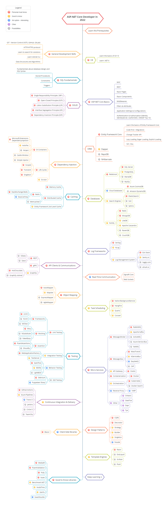

# ASP.NET Core Geliştirici Yol Haritası

- [Karanlık Versiyon](https://raw.githubusercontent.com/stackdev19/AspNetCore-Developer-Roadmap/master/aspnetcore-developer-roadmap.png)
- [Basitleştirilmiş Çince'de beni oku](ReadMe.zh-Hans.md)
- [Geleneksel Çince'de beni oku](ReadMe.zh-Hant.md)

> 2022'de [ASP.NET Core](https://docs.microsoft.com/aspnet/core) geliştirici olma yol haritası:

Aşağıda, ASP.NET Core geliştiricisi olmak için izleyebileceğiniz yolları ve öğrenmek isteyeceğiniz kitaplıkları gösteren bir tablo bulabilirsiniz. Bu çizelgeyi bana "Bir ASP.NET Core geliştiricisi olarak bundan sonra ne öğrenmeliyim?" diye soran herkese bir ipucu olarak hazırladım.

## Sorumluluk Kabul Edilmez

> Bu yol haritasının amacı, size manzara hakkında bir fikir vermektir. Yol haritası, bir sonraki adımda ne öğreneceğiniz konusunda kafanız karıştıysa, sizi havalı ve modaya uygun olanı seçmeye teşvik etmek yerine size rehberlik edecektir. Bir aracın neden bazı durumlar için diğerinden daha uygun olduğuna dair bir anlayış geliştirmelisiniz ve modaya uygun ve modaya uygun her zaman iş için en uygun anlamına gelmediğini unutmayın.

## Bir Yıldız Ver! :star:

Çözümünüzü öğrenmek veya başlatmak için bu projeyi beğendiyseniz veya kullanıyorsanız, lütfen ona bir yıldız verin. Teşekkürler!
## Yol Haritası

## Kaynaklar

1. Ön koşulları öğrenin

   - [C#](https://www.pluralsight.com/paths/csharp)
   - [.NET 6](https://devblogs.microsoft.com/dotnet/announcing-net-6)
   - [Entity Framework](https://www.pluralsight.com/search?q=entity%20framework%20core)
   - [Dapper](https://github.com/StackExchange/Dapper)
   - [NHibernate](https://github.com/nhibernate/nhibernate-core)
   - [ASP.NET Core](https://www.pluralsight.com/search?q=asp.net%20core)
   - SQL temel bilgiler

2. Genel Gelişim Becerileri

   - GIT öğrenin, GitHub'da birkaç depo oluşturun, kodunuzu başkalarıyla paylaşın
   - HTTP(S) protokolünü, istek yöntemlerini (GET, POST, PUT, PATCH, DELETE, OPTIONS) bilin
   - Google kullanmaktan korkmayın, [Google ile Güçlü Arama](http://www.powersearchingwithgoogle.com)
   - [dotnet CLI](https://docs.microsoft.com/dotnet/core/tools) öğrenin
   - Algoritmalar ve veri yapıları hakkında birkaç kitap okuyun

3. ASP.NET Core Temelleri

   - [MVC](https://docs.microsoft.com/en-us/aspnet/core/mvc/overview?view=aspnetcore-6.0)
   - [REST](https://docs.microsoft.com/en-us/aspnet/core/tutorials/first-web-api?view=aspnetcore-6.0&tabs=visual-studio)
   - [Razor Sayfaları](https://docs.microsoft.com/en-us/aspnet/core/razor-pages/?view=aspnetcore-6.0&tabs=visual-studio)
   - [Razor Bileşenleri](https://docs.microsoft.com/en-us/aspnet/core/blazor/components/?view=aspnetcore-6.0)
   - [Ara Yazılımlar](https://docs.microsoft.com/en-us/aspnet/core/fundamentals/middleware/?view=aspnetcore-6.0)
   - [Filtreler ve Özellikler](https://docs.microsoft.com/en-us/aspnet/core/mvc/controllers/filters?view=aspnetcore-6.0)
   - [Uygulama Ayarları ve Konfigürasyonlar](https://docs.microsoft.com/en-us/aspnet/core/fundamentals/configuration/?view=aspnetcore-6.0)
   - [Kimlik Doğrulama](https://docs.microsoft.com/en-us/aspnet/core/security/authentication/?view=aspnetcore-6.0)
   - [Yetkilendirme](https://docs.microsoft.com/en-us/aspnet/core/security/authorization/introduction?view=aspnetcore-6.0)
   - [IdentityServer](https://identityserver4.readthedocs.io/en/latest)
   - [Auth0](https://auth0.com/docs)
   - [OIDC](https://openid.net/connect)

4. SOLID

    - [Tek Sorumluluk İlkesi (SRP)](https://www.dotnetcurry.com/software-gardening/1148/solid-single-responsibility-principle)
    - [Açık-Kapalı Prensibi (OCP)](https://www.dotnetcurry.com/software-gardening/1176/solid-open-closed-principle)
    - [Liskov Substitution Prensibi (LSP)](https://www.dotnetcurry.com/software-gardening/1235/liskov-substitution-principle-lsp-solid-patterns)
    - [Arayüz Ayrımı Prensibi (ISP)](https://www.dotnetcurry.com/software-gardening/1257/interface-segregation-principle-isp-solid-principle)
    - [Bağımlılık Tersine Çevirme Prensibi (DIP)](https://www.dotnetcurry.com/software-gardening/1284/dependency-injection-solid-principles)

5. Bağımlılık Enjeksiyonu

   1. DI Containers
      - [Microsoft.Extensions.DependencyInjection](https://docs.microsoft.com/aspnet/core/fundamentals/dependency-injection)
      - [AutoFac](https://autofaccn.readthedocs.io/en/latest/integration/aspnetcore.html)
      - [Ninject](http://www.ninject.org)
      - [Castle Windsor](https://github.com/castleproject/Windsor)
	  - [Simple Injector](https://github.com/simpleinjector/SimpleInjector)
   2. [Life Cycles](https://docs.microsoft.com/aspnet/core/fundamentals/dependency-injection#service-lifetimes)
   3. [Scrutor](https://github.com/khellang/Scrutor)

6. Veritabanları

   1. İlişkisel
      1. [SQL Server](https://www.microsoft.com/sql-server/sql-server-2019)
      2. [PostgreSQL](https://www.postgresql.org)
      3. [MariaDB](https://mariadb.org)
      4. [MySQL](https://www.mysql.com)
   2. Bulut Veritabanları
      - [CosmosDB](https://docs.microsoft.com/azure/cosmos-db)
      - [DynamoDB](https://aws.amazon.com/dynamodb)
   3. Arama Motorları
      - [ElasticSearch](https://www.elastic.co)
      - [Solr](http://lucene.apache.org/solr)
      - [Sphinx](http://sphinxsearch.com)
   4. NoSQL
      - [Redis](https://redis.io)
      - [MongoDB](https://docs.microsoft.com/aspnet/core/tutorials/first-mongo-app)
      - [Apache Cassandra](http://cassandra.apache.org)
      - [LiteDB](https://github.com/mbdavid/LiteDB)
      - [RavenDB](https://github.com/ravendb/ravendb)
      - [CouchDB](http://couchdb.apache.org)

7. Önbelleğe Almak

   1. [Bellek Önbelleği](https://docs.microsoft.com/aspnet/core/performance/caching/memory)
   2. [Dağıtılmış Önbellek](https://docs.microsoft.com/aspnet/core/performance/caching/distributed)
      1. [Redis](https://redis.io/)
         1. [StackExchange.Redis](https://stackexchange.github.io/StackExchange.Redis)
         2. [EasyCaching](https://github.com/dotnetcore/EasyCaching)
      2. [Memcached](https://memcached.org)
   3. Entity Framework 2. Seviye Önbellek
      1. [EFCoreSecondLevelCacheInterceptor](https://github.com/VahidN/EFCoreSecondLevelCacheInterceptor)
      2. [EntityFrameworkCore.Cacheable](https://github.com/SteffenMangold/EntityFrameworkCore.Cacheable)

8. Logging

   1. Log Frameworks
      - [Serilog](https://github.com/serilog/serilog)
      - [NLog](https://github.com/NLog/NLog)
   2. Log Yönetim Sistemi
      - [ELK Stack](https://www.elastic.co/what-is/elk-stack)
      - [Sentry.io](http://sentry.io)
      - [Loggly.com](https://loggly.com)
      - [Elmah.io](http://elmah.io)
      
9. API İstemcileri ve İletişim

    1. REST
       - [OData](https://devblogs.microsoft.com/odata/experimenting-with-odata-in-asp-net-core-3-1)
       - [Sieve](https://github.com/Biarity/Sieve)
    2. [gRPC](https://docs.microsoft.com/en-us/aspnet/core/grpc)
    3. GraphQL
       - [HotChocolate](https://github.com/ChilliCream/hotchocolate)
       - [GraphQL-dotnet](https://github.com/graphql-dotnet/graphql-dotnet)

10. Gerçek Zamanlı İletişim

   - [SignalR](https://docs.microsoft.com/aspnet/core/signalr)
   - [WebSockets](https://docs.microsoft.com/en-us/aspnet/core/fundamentals/websockets)
   
11. Nesne Eşleme

   - [AutoMapper](https://github.com/AutoMapper/AutoMapper)
   - [Mapster](https://github.com/MapsterMapper/Mapster)
   - [ExpressMapper](http://expressmapper.org/)
   - [AgileMapper](https://github.com/agileobjects/AgileMapper)
   
12. Görev Zamanlama

    - [Background Service](https://docs.microsoft.com/en-us/aspnet/core/fundamentals/host/hosted-services)
    - [HangFire](https://github.com/HangfireIO/Hangfire)
    - [Quartz](https://github.com/quartznet/quartznet)
    - [Coravel](https://github.com/jamesmh/coravel)    
    
13. Test

    1. Birim Testi
       1. Frameworks
          - [xUnit](https://docs.microsoft.com/dotnet/core/testing/unit-testing-with-dotnet-test)
          - [NUnit](https://docs.microsoft.com/dotnet/core/testing/unit-testing-with-nunit)
          - [MSTest](https://docs.microsoft.com/dotnet/core/testing/unit-testing-with-mstest)
       2. Mocking
          - [Moq](https://github.com/moq/moq4)
          - [NSubstitute](https://github.com/nsubstitute/NSubstitute)
          - [FakeItEasy](https://github.com/FakeItEasy/FakeItEasy)
       3. Assertion
          - [FluentAssertion](https://github.com/fluentassertions/fluentassertions)
          - [Shouldly](https://github.com/shouldly/shouldly)
    2. Entegrasyon Testi
       - [WebApplicationFactory](https://docs.microsoft.com/aspnet/core/test/integration-tests)
       - [TestServer](https://koukia.ca/integration-testing-in-asp-net-core-2-0-51d14ede3968)
    3. Davranış Testi
       - [SpecFlow](https://github.com/techtalk/SpecFlow/tree/DotNetCore)
       - [BDDfy](https://github.com/TestStack/TestStack.BDDfy)
       - [LightBDD](https://github.com/LightBDD/LightBDD)
    4. E2E Testi
       - [Selenium](https://www.hanselman.com/blog/real-browser-integration-testing-with-selenium-standalone-chrome-and-aspnet-core-21)
       - [Puppeteer-Sharp](https://github.com/kblok/puppeteer-sharp)

14. Mikro Hizmetler

    1. Mesaj Aracısı
       - [RabbitMQ](https://www.rabbitmq.com/tutorials/tutorial-one-dotnet.html)
       - [Apache Kafka](https://github.com/confluentinc/confluent-kafka-dotnet)
       - [ActiveMQ](https://github.com/apache/activemq)
       - [Azure Service Bus](https://docs.microsoft.com/azure/service-bus-messaging/service-bus-messaging-overview)
       - [NetMQ](https://github.com/zeromq/netmq)
    2. Message-Bus
       - [MassTransit](https://github.com/MassTransit/MassTransit)
       - [NServiceBus](https://github.com/Particular/NServiceBus)
       - [EasyNetQ](https://github.com/EasyNetQ/EasyNetQ)
       - [CAP](https://github.com/dotnetcore/CAP)
    3. API Geçiti
       - [Ocelot](https://github.com/ThreeMammals/Ocelot)
    4. Containerization
       - [Docker](https://www.docker.com)
    5. Orkestrasyon
       - [Kubernetes](https://kubernetes.io)
       - [Docker Swarm](https://docs.docker.com/engine/swarm)
    6. Ters Proxy
       - [YARP](https://github.com/microsoft/reverse-proxy)
    7. Diğer
       - [Orleans](https://github.com/dotnet/orleans)
       - [Steeltoe](https://steeltoe.io)
       - [Dapr](https://github.com/dapr/dapr)
       - [Tye](https://github.com/dotnet/tye)

15. Sürekli Entegrasyon ve Teslimat
    - [Github Actions](https://github.com/features/actions)
    - [Azure Pipelines](https://azure.microsoft.com/en-us/services/devops/pipelines)
    - [Travis CI](https://travis-ci.org)
    - [Jenkins](https://www.jenkins.io)
    - [Circle CI](https://circleci.com)
    - [TeamCity](https://www.jetbrains.com/teamcity)

16. Tasarım Desenleri

    - [CQRS](https://docs.microsoft.com/azure/architecture/patterns/cqrs)
    - [Decorator](https://www.dofactory.com/net/decorator-design-pattern)
    - [Strategy](https://www.dofactory.com/net/strategy-design-pattern)
    - [Builder](https://www.dofactory.com/net/builder-design-pattern)
    - [Singleton](https://www.dofactory.com/net/singleton-design-pattern)
    - [Facade](https://www.dofactory.com/net/facade-design-pattern)

17. İstemci Taraflı Kitaplıklar
    - [Blazor](https://dotnet.microsoft.com/apps/aspnet/web-apps/blazor)

18. Şablon Motorları

   - [Razor](https://docs.microsoft.com/aspnet/core/mvc/views/razor)
   - [DotLiquid](https://github.com/dotliquid/dotliquid)
   - [Scriban](https://github.com/lunet-io/scriban)
   - [Fluid](https://github.com/sebastienros/fluid)

19. Bunlarıda bilmen iyi olur

    - [MediatR](https://github.com/jbogard/MediatR)
    - [Fluent Validation](https://github.com/JeremySkinner/FluentValidation)
    - [Polly](https://github.com/App-vNext/Polly)    
    - [Benchmark.NET](https://github.com/dotnet/BenchmarkDotNet)
    - [NodaTime](https://github.com/nodatime/nodatime)
    - [GenFu](https://github.com/MisterJames/GenFu)
    - [Swashbuckle](https://github.com/domaindrivendev/Swashbuckle.AspNetCore)

## Geliştirmek için

Yol haritasının iyileştirilebileceğini düşünüyorsanız, lütfen güncellemeleri içeren bir PR açın ve sorunları gönderin. Ayrıca, bunu geliştirmeye devam edeceğim, bu yüzden tekrar ziyaret etmek için bu depoya yıldız eklemek isteyebilirsiniz.

fikir : [React Geliştirici Yol Haritası](https://github.com/adam-golab/react-developer-roadmap)

## Katkı

katkıda bulunmak ister misiniz? Topluluk geri bildirimlerini ve katkılarını teşvik ediyoruz. Lütfen [katkıda bulunan yönergelerimize](https://github.com/stackdev19/AspNetCore-Developer-Roadmap/blob/master/CONTRIBUTING.md) uyun.

## Lisans

